[Portafolio](https://developer-marx.netlify.app/) &nbsp;·&nbsp; [LinkedIn](https://www.linkedin.com/in/marx-alonso-chipana) &nbsp;·&nbsp; [marxchip99@gmail.com](mailto:marxchip99@gmail.com) &nbsp;·&nbsp; [WhatsApp](https://wa.me/51922061911) &nbsp;·&nbsp; [Blog](https://blogmarxingsoftware.blogspot.com/)

## Sobre mí

Ingeniero de Software Full-Stack en Lima, Perú, con 3 años construyendo aplicaciones web de punta a punta: del diseño de la interfaz al despliegue en producción.

Trabajo el frontend con React, Next.js, Astro y Angular, y el backend con NestJS, FastAPI, Spring Boot, Laravel, Node.js y Go. También desarrollo y mantengo sitios profesionales en WordPress con Elementor, Divi y código a medida.

## Stack

<picture>
  <source media="(max-width: 640px)" srcset="./assets/stack-mobile.svg" />
  
</picture>

## Proyectos en producción

| Sitio | Descripción | Stack |
| :---- | :---------- | :---- |
| [Excelsius](https://www.excelsius.biz/) | Sitio institucional de una empresa de software a medida y cursos en vivo: hero dibujado en canvas, blog y catálogo de cursos. | Astro · TypeScript · Canvas · SEO |
| [BeSocial Marketing](https://besocial-marketing.com/) | Web de una agencia de marketing digital con alcance en Perú, USA y LATAM. Multiidioma, tema claro/oscuro y blog. | Astro · i18n |
| [Ducas Import](https://ducasimport.pe/) | Tienda online de skincare coreano: catálogo por marcas, carrito, cuentas de usuario y canal para mayoristas. | Next.js · React · E-commerce |
| [Operación Fortuna](https://carlosampuero.pe/) | Plataforma de sorteos por suscripción con Carlos Ampuero: rangos, registro e inicio de sesión de usuarios. | Next.js · React |
| [HomeHelp Salud](https://homehelp.com.pe/) | Servicios de salud a domicilio en Lima: enfermería, cuidado de adulto mayor y alquiler de equipos médicos. | Next.js · React |
| [Carnicentro Marcelo](https://carnicentromarcelo.com/) | Carnicería en Lima con delivery: catálogo de cortes de res y cerdo con precio por kilo, pedidos por WhatsApp y blog. | Next.js · React |
| [Chipana Real Estate](https://www.chipanarealestate.com/) | Sitio bilingüe de un agente inmobiliario en Georgia, USA: listado de propiedades, blog y contacto por WhatsApp. | Next.js · i18n |

## Experiencia

| Periodo | Rol | Empresa | Stack y resultados |
| :------ | :-- | :------ | :----------------- |
| Jul 2026 — Actualidad | Programador Full Stack | 3R Core Agencia de Marketing | WordPress · Next.js · SEO técnico |
| Feb 2026 — Actualidad | Desarrollador Web WordPress y Consultor de Optimización Digital | Hispano Tesis Excelsius | WordPress · Elementor · Astro |
| Nov 2025 — Actualidad | Analista Programador | Famat Consulting | CRM a medida · integraciones |
| Mar — Ago 2025 | Desarrollador Web Freelancer | 3RCore Agencia de Marketing | WordPress · Elementor · Divi · −40 % en tiempo de carga |
| Ene — Feb 2025 | Líder de Proyecto Web | AventuraGym | React · TypeScript · TailwindCSS |
| Feb 2024 | Desarrollador Full-Stack | IBSeguros (CorpIBGroup) | Laravel · Vue.js · MySQL |
| Ene 2024 | Líder de Migración | IBContrata (CorpIBGroup) | Laravel 10 · API REST · JWT · −30 % en tiempo de respuesta |
| Dic 2023 | Desarrollador de Escritorio | Sistema de Gestión de Gimnasio | Java · MySQL · −60 % en tiempo de administración |
| Jul — Nov 2023 | Desarrollador Frontend | Proyectos Web Corporativos | React · Next.js · TailwindCSS |
| Ene — Jun 2023 | Desarrollador Web | Proyectos con WordPress | WordPress · PHP · CSS · JavaScript |

El detalle de cada etapa está en [mi portafolio](https://developer-marx.netlify.app/).

## GitHub

