<div align="center">

<a href="https://developer-marx.netlify.app/">
  
</a>

<a href="https://developer-marx.netlify.app/"></a>
<a href="https://www.linkedin.com/in/marx-alonso-chipana"></a>
<a href="mailto:marxchip99@gmail.com"></a>
<a href="https://wa.me/51922061911"></a>
<a href="https://blogmarxingsoftware.blogspot.com/"></a>

</div>

<br />

## `~/sobre-mi`



Soy **Ingeniero de Software Full-Stack** de Lima, Perú, con **3 años** construyendo aplicaciones web de punta a punta: del diseño de la interfaz al despliegue en producción.

- **Frontend** interactivo y responsive con React, Next.js, Astro y Angular.
- **Backend** escalable con NestJS, FastAPI, Spring Boot, Laravel, Node.js y Go.
- **WordPress** profesional con Elementor, Divi y código a medida.

## `~/stack`

<table>
  <tr>
    <th width="50%">Frameworks · Frontend</th>
    <th width="50%">Frameworks · Backend</th>
  </tr>
  <tr>
    <td align="center">
      <br />
      <sub>React · Next.js · Astro · Angular · Tailwind · Bootstrap</sub>
    </td>
    <td align="center">
      <br />
      <sub>NestJS · FastAPI · Spring Boot · Laravel · Node.js</sub>
    </td>
  </tr>
  <tr>
    <th>CMS</th>
    <th>Lenguajes</th>
  </tr>
  <tr>
    <td align="center">
      <br />
      <sub>WordPress · Elementor · Divi · temas hijo · PHP a medida</sub>
    </td>
    <td align="center">
      <br />
      <sub>TypeScript · JavaScript · Python · Go · Java · PHP · Kotlin</sub>
    </td>
  </tr>
  <tr>
    <th>Bases de datos</th>
    <th>Deploy y herramientas</th>
  </tr>
  <tr>
    <td align="center">
      <br />
      <sub>PostgreSQL · MySQL</sub>
    </td>
    <td align="center">
      <br />
      <sub>Git · GitHub · Netlify · Vercel · Cloudflare · Figma · Postman</sub>
    </td>
  </tr>
</table>

## `~/proyectos` · webs en producción

Sitios reales, en línea y en uso: los diseñé, programé y desplegué.

|     | Sitio | Qué es | Stack |
| :-: | :---- | :----- | :---- |
| 01 | [**Excelsius**](https://www.excelsius.biz/) | Sitio institucional de una empresa de software a medida y cursos en vivo: hero dibujado en canvas, blog y catálogo de cursos. | `Astro` `TypeScript` `Canvas` `SEO` |
| 02 | [**BeSocial Marketing**](https://besocial-marketing.com/) | Web de una agencia de marketing digital con alcance en Perú, USA y LATAM. Multiidioma, tema claro/oscuro y blog. | `Astro` `i18n` `Blog` |
| 03 | [**Ducas Import**](https://ducasimport.pe/) | Tienda online de skincare coreano: catálogo por marcas, carrito, cuentas de usuario y canal para mayoristas. | `Next.js` `React` `E-commerce` |
| 04 | [**Operación Fortuna**](https://carlosampuero.pe/) | Plataforma de sorteos por suscripción con Carlos Ampuero: rangos, registro e inicio de sesión de usuarios. | `Next.js` `React` `Suscripciones` |
| 05 | [**HomeHelp Salud**](https://homehelp.com.pe/) | Servicios de salud a domicilio en Lima: enfermería, cuidado de adulto mayor y alquiler de equipos médicos. | `Next.js` `React` `Blog` |
| 06 | [**Carnicentro Marcelo**](https://carnicentromarcelo.com/) | Carnicería en Lima con delivery: catálogo de cortes de res y cerdo con precio por kilo, pedidos por WhatsApp y blog. | `Next.js` `React` `Catálogo` |
| 07 | [**Chipana Real Estate**](https://www.chipanarealestate.com/) | Sitio bilingüe de un agente inmobiliario en Georgia, USA: listado de propiedades, blog y contacto por WhatsApp. | `Next.js` `i18n` `Inmobiliaria` |

## `~/experiencia` · git log --graph

```text
marx@github:~/experiencia$ git log --graph --all

* f4c07e1 (HEAD -> main) Programador Full Stack @ 3R Core Agencia de Marketing
|         Jul 2026 — Actualidad · WordPress, Next.js, SEO técnico
* 2b9d5a6 Desarrollador Web WordPress & Consultor de Optimización Digital @ Hispano Tesis Excelsius
|         Feb 2026 — Actualidad · WordPress, Elementor, Astro, SEO · GEO · AEO
* d6e18b3 Analista Programador @ Famat Consulting
|         Nov 2025 — Actualidad · CRM a medida, integraciones, Termux
* a3f91c2 Desarrollador Web Freelancer @ 3RCore Agencia de Marketing
|         Mar 2025 — Ago 2025 · WordPress, Elementor, Divi · ▲ −40 % tiempo de carga
* 7be04d8 Líder de Proyecto Web @ AventuraGym
|         Ene 2025 — Feb 2025 · React, TypeScript, TailwindCSS
* c21e7a5 Desarrollador Full-Stack @ IBSeguros (CorpIBGroup)
|         Feb 2024 · Laravel, Vue.js, MySQL
* 9d48f03 Líder de Migración @ IBContrata (CorpIBGroup)
|         Ene 2024 · Laravel 10, API REST, JWT · ▲ −30 % tiempo de respuesta
* 5ac6b19 Desarrollador de Escritorio @ Sistema de Gestión de Gimnasio
|         Dic 2023 · Java, MySQL · ▲ −60 % tiempo de administración
* e80b3f4 Desarrollador Frontend @ Proyectos Web Corporativos
|         Jul 2023 — Nov 2023 · React, Next.js, TailwindCSS, Netlify
* 1f7d2ae Desarrollador Web @ Proyectos con WordPress
          Ene 2023 — Jun 2023 · WordPress, PHP, CSS, JavaScript
```

El detalle de cada etapa está en [mi portafolio](https://developer-marx.netlify.app/).

## `~/stats`

<div align="center">


<picture>
  <source media="(prefers-color-scheme: dark)" srcset="https://raw.githubusercontent.com/MarxAlonso/MarxAlonso/output/github-contribution-grid-snake-dark.svg" />
  
</picture>


</div>
